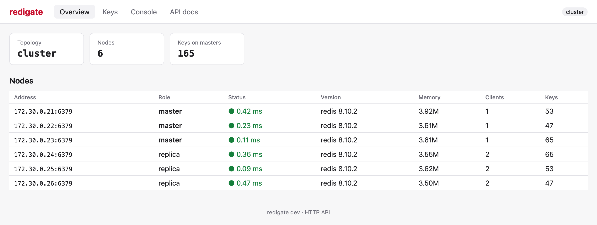
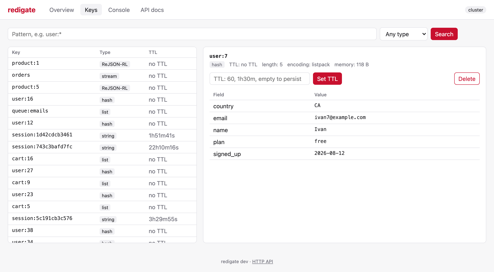
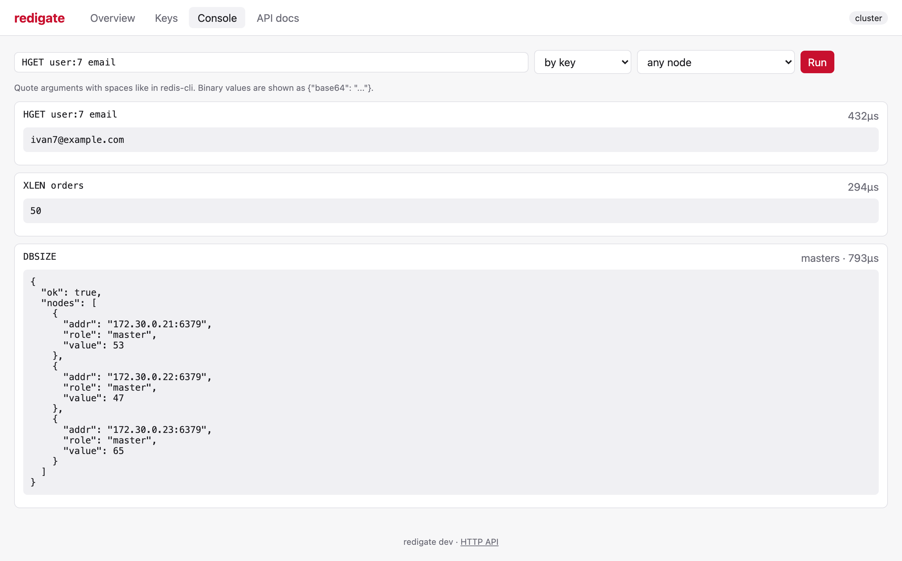

# Web UI and Swagger UI

Both are served on the API address when `UI_ENABLED=true` (the default).

## Web UI

A small interface at `http://<HTTP_ADDR>/ui/` (`/` redirects to it), built with server-rendered
HTML and [htmx](https://htmx.org) and embedded into the binary: no build step and no CDN.

### Overview

Topology and every node with its role, latency, server version, memory, clients and keys.

<picture>
  <source media="(prefers-color-scheme: dark)" srcset="images/overview-dark.png">
  
</picture>

### Keys

SCAN with a pattern and a type filter loaded page by page while scrolling, the value of any type,
TTL changes and deletion. Binary keys and values are shown as base64.

<picture>
  <source media="(prefers-color-scheme: dark)" srcset="images/keys-dark.png">
  
</picture>

### Console

A redis-cli style command line sent by key, to all masters, replicas or nodes, or to a given
node; string replies are shown as they are, other replies as JSON.

<picture>
  <source media="(prefers-color-scheme: dark)" srcset="images/console-dark.png">
  
</picture>

### Access

The UI uses the same service layer and access rules as the API. When a token is configured the
UI asks for it once and keeps it in an HttpOnly `SameSite=Strict` cookie; with the read-only
token destructive actions are hidden and denied. Requests changing data are accepted only from
htmx (`HX-Request` header), and the pages can't be framed by other sites.

## Swagger UI

Swagger UI at `/api/v1/docs/` renders the OpenAPI specification of every endpoint. "Try it out"
sends requests to the same server: with authentication enabled press Authorize and enter
`Bearer <token>`. The specification itself is at `/api/v1/openapi.json` and
`/api/v1/openapi.yaml` and needs no token.
